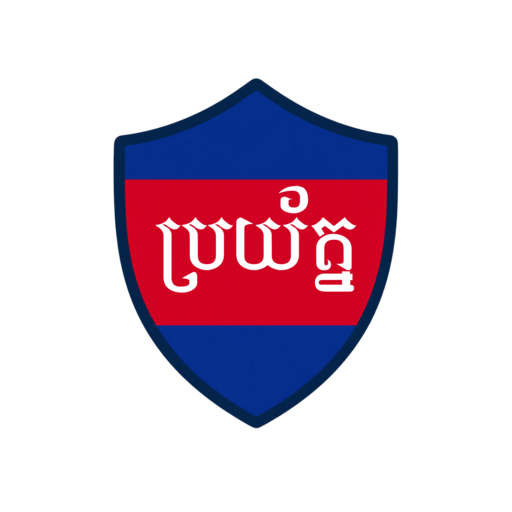

<div align="center">



# Broryat AI 

AI-powered Telegram bot that detects scams, phishing, and malware in Khmer and English.

[](LICENSE)
[](.python-version)
[](https://docs.astral.sh/uv/)
[](CONTRIBUTING.md)

[Features](docs/features.md) • [Architecture](docs/architecture.md) • [Getting started](#getting-started) • [Configuration](docs/configuration.md) • [Deployment](docs/deployment.md) • [Contributing](CONTRIBUTING.md)

</div>

## Overview

Telegram is widely used in Cambodia and increasingly abused for phishing, fake job offers, fake account-verification prompts, banking scams, and malware delivery — many aimed at users who have no easy way to tell a scam from a legitimate message.

Broryat AI ("ប្រយ័ត្ន", *beware*) scans forwarded messages, uploaded files, and links a user sends it, and replies in plain Khmer or English with a risk verdict and a recommended action. It combines two independent signals:

- An **AI intent classifier** (provider-agnostic — Gemini, OpenAI, Anthropic, Hugging Face, or Broryat) reads message text and screenshots for social-engineering patterns.
- **VirusTotal API v3** checks file hashes and URLs against dozens of security engines.

> **Important:** When VirusTotal has a confirmed verdict for a file or URL, it always overrides the AI's judgment.

See [`docs/features.md`](docs/features.md) for the full feature list, [`docs/architecture.md`](docs/architecture.md) for how the pieces fit together, and [`docs/requirements.md`](docs/requirements.md) for the product requirements and long-term roadmap.

### Chat Automation

Add Broryat to Telegram Chat Automation to scan files and links received in your private chats:

- Incoming URLs and supported files are checked by VirusTotal; ordinary conversation is ignored.
- Confirmed malicious content shows owner-only **Delete** and **Keep** controls with detection details and a false-positive disclaimer.
- The action notice disappears five seconds after a successful choice.
- Scan records use anonymous user/chat IDs and never store private-chat text.

## Getting started

**Prerequisites**: a Postgres database (e.g. [Supabase](https://supabase.com)), a [Telegram bot token](https://core.telegram.org/bots#how-do-i-create-a-bot), a [VirusTotal API key](https://www.virustotal.com/gui/join-us), and an API key for at least one AI provider.

> **Warning:** The bot downloads whatever files users send it — including real malware — so it can hash and scan them. **Run it in Docker, not directly on your laptop**, so any malicious file stays contained to the container instead of touching your filesystem.

```bash
git clone https://github.com/COPPSARY/broryat-a.git
cd broryat-a
cp .env.example .env   # fill in your tokens/keys, see docs/configuration.md

docker build -t broryat-ai .
docker run -d --name broryat-ai --env-file .env --restart unless-stopped broryat-ai
docker logs -f broryat-ai
```

See [`docs/deployment.md`](docs/deployment.md) for rebuilding/redeploying and Render instructions, and [`docs/configuration.md`](docs/configuration.md) for every `.env` variable.

### Running without Docker

Only do this if you understand the risk above (e.g. contributing code changes with no real file scanning involved). Requires Python 3.13 (pinned in `.python-version`) and [uv](https://docs.astral.sh/uv/):

```bash
uv sync
uv run main.py
```

> **Tip:** You don't need any real credentials to explore the codebase or run the test suite (`uv run -m pytest`) — every external API is mocked, and the database runs against in-memory SQLite. No files are downloaded in tests.

## Project status

Broryat AI is being built in phases. **Phase 1 is complete and is what this repo runs today.**

| Phase | Scope | Status |
|---|---|---|
| 1 | Telegram bot: AI + VirusTotal detection for text, files, and URLs; Khmer & English support; group protection and owner-confirmed Telegram Business moderation | ✅ Implemented |
| 2 | Configurable per-group strictness and compromised-account detection (a trusted member suddenly posting malware/phishing) | Planned |
| 3 | Threat-intelligence database and analytics dashboard | Planned |
| 4 | Takedown/reporting workflow with a public API | Planned |

See [`docs/requirements.md`](docs/requirements.md) for the full requirements behind each phase.

## Contributing

Contributions are welcome — bug reports, feature requests, and pull requests alike. See [`CONTRIBUTING.md`](CONTRIBUTING.md) for dev setup, running tests, and PR expectations.

## License

Licensed under the [Apache License 2.0](LICENSE).
